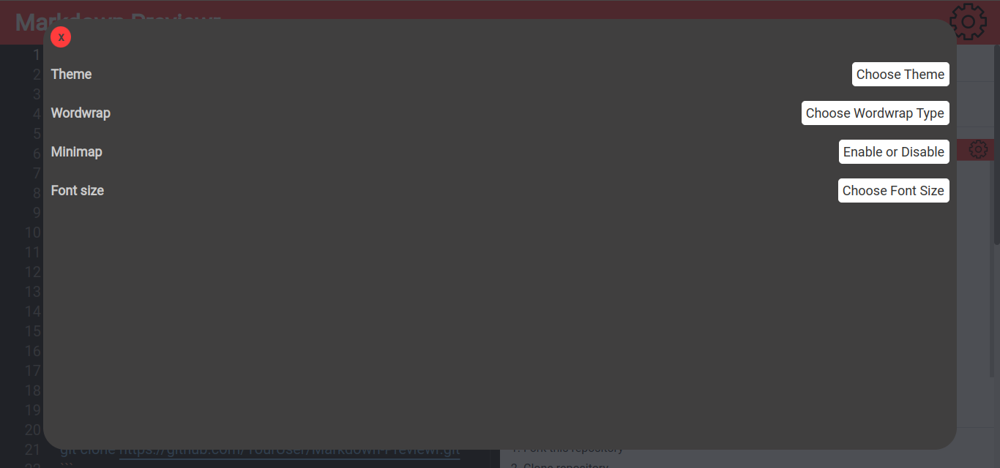

# Markdown Previewr 📖

## Index

1. [Preview](##Preview)
2. [Contributions](##Contributions)
3. [Licence](##Licence)
4. [Dependencies](##Dependencies)

## Preview




## Contributions

1. Fork this repository
2. Clone repository

**SSH**

```bash
git clone git@github.com:YourUser/Markdown-Previewr.git
```

**HTTPS**

```
git clone https://github.com/YourUser/Markdown-Previewr.git
```

3. Create a new branch
4. Make your changes
5. Create a pull request

## Licence

MIT

## Dependencies

- [reactjs](https://reactjs.org)
- [typescript](https://www.typescriptlang.org/)
- [vite](https://vitejs.dev/)
- [@monaco-editor/react](https://github.com/suren-atoyan/monaco-react)
- [@uiw/react-markdown-preview](https://github.com/uiwjs/react-markdown-preview)
